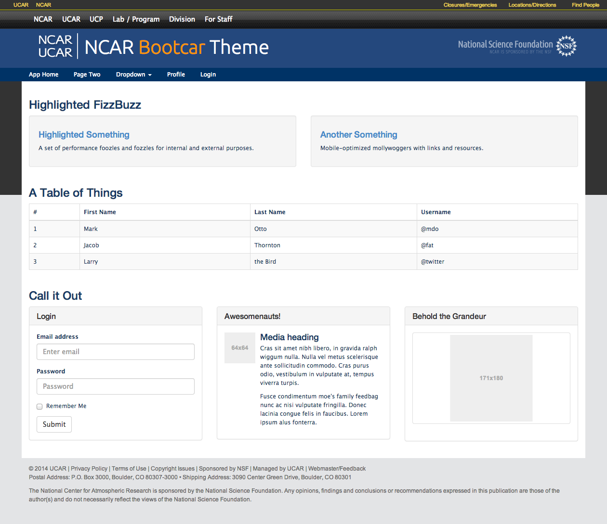
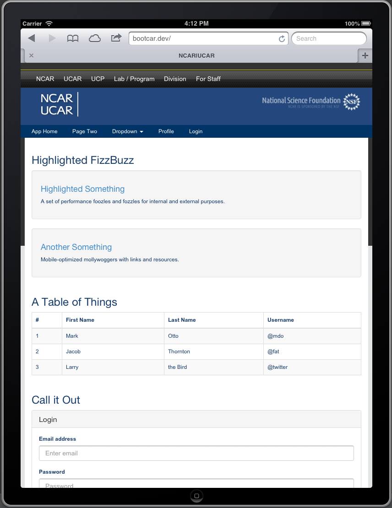
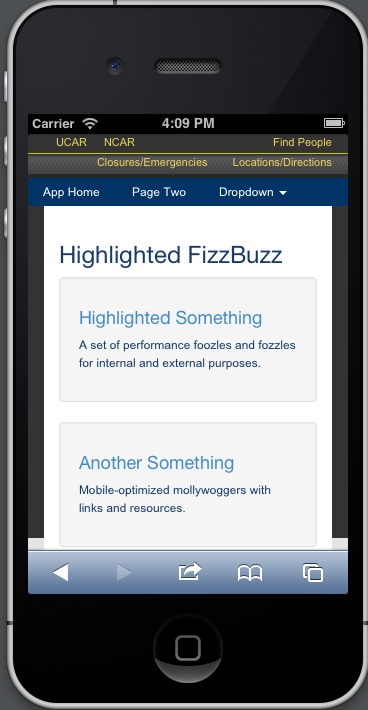

atmos-bootstrap
===============

### a.k.a Bootcar

A very basic, very alpha, Atmos-look-a-like theme built with [Bootstrap 3](getbootstrap.com). It's just front end, i.e. non-Drupal and framework agnostic.

Version 0.1-alpha

### Screenshots

#### Desktop

#### Tablet

#### Phone

